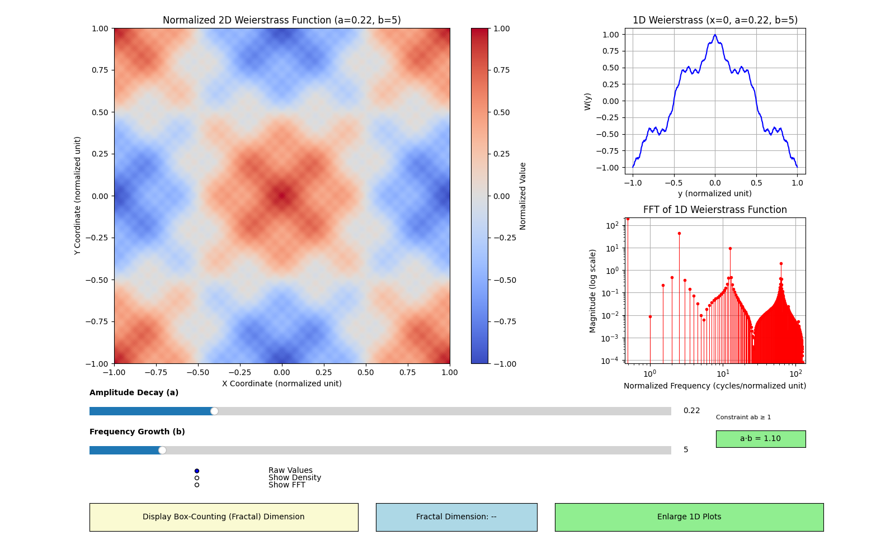
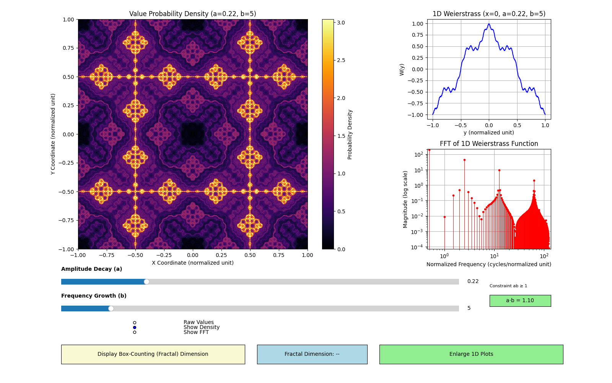
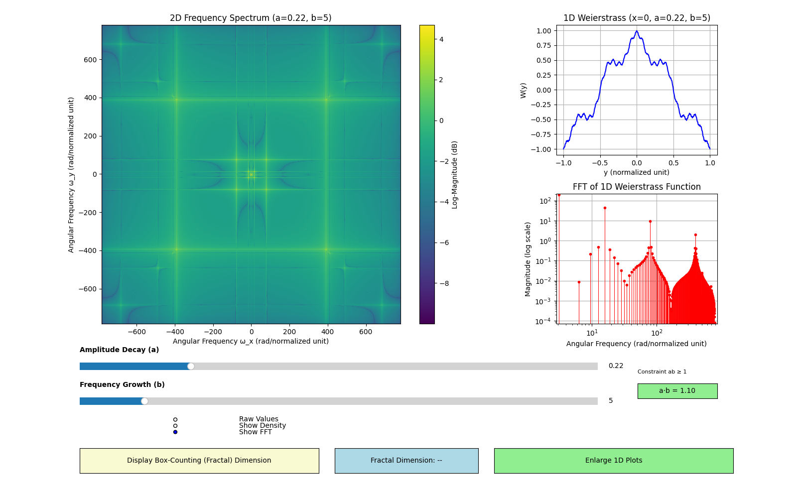
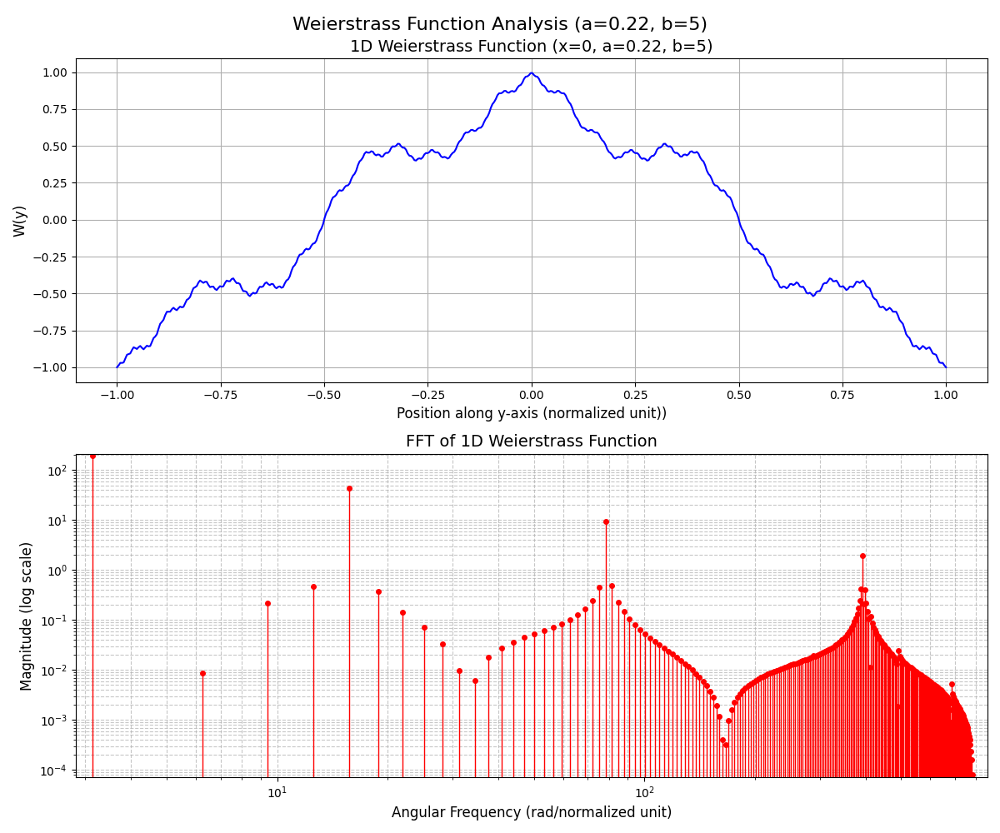
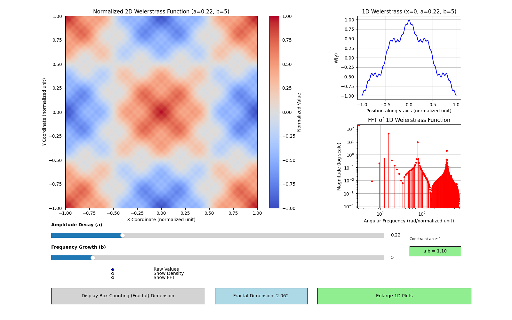

# 🌀 2D-Weierstrass Function Visualization Toolkit


## 📌 Overview

This interactive Python tool visualizes the **2D Weierstrass function**—a fascinating extension of the classic 1D function known for being **continuous everywhere but differentiable nowhere**. The application provides multiple perspectives on this mathematical curiosity, including:

1. Raw function visualization (2D and 1D)
2. Density distribution mapping (2D)
3. Frequency spectrum analysis (FFT for both 2D and 1D)
4. Fractal dimension calculation (2D)

---

## 🚀 Key Features

* **Interactive controls** for parameters `a` (amplitude decay) and `b` (frequency scaling)
* **Multiple visualization modes**:
  * Raw function values (2D and 1D)
  * Value density distribution (2D)
  * Fast Fourier Transform (FFT) spectrum (2D and 1D)
* **Box-counting dimension** calculation for fractal analysis
* **Real-time updates** via Numba-accelerated computation
* **Constraint Indicator** indicating when fractal behavior emerges (a·b ≥ 1)
* **Scientific Accuracy**:
  * Correct dB scaling for FFT (20log₁₀)
  * Angular frequency units (rad/normalized unit)
  * Nyquist-limited spectral display

---

## 📐 Mathematical Foundation

The 2D Weierstrass function is defined as:

$$
\Huge
W(x, y) = \sum_{n=0}^{N} a^n \cdot \cos(\pi b^n x) \cdot \cos(\pi b^n y)
$$

Where:

* a in (0,1) controls **amplitude decay**.
* b in {3, 5, 7, ...} (odd integers) controls **exponential frequency growth**.
* N = 40 is the number of terms used for approximation.

> **Note on Finite Approximation**  
> While the infinite Weierstrass function is continuous everywhere but nowhere differentiable, our visualization uses a finite approximation (\(N = 40\) terms). This truncated version:  
>
> * Is a trigonometric polynomial (finite sum of continuous cosines).  
> * Permits standard FFT analysis (unlike the infinite sum).  
> * Captures emergent fractal properties when $(a \cdot b \geq 1)$.  
>  
> The FFT visualizations show the exact spectral composition of this approximation.

---

**Relationship to Classic 1D Weierstrass Function**  
The 1D slice at \(x = 0\) recovers the original 1D Weierstrass function:  

$$
\Huge
W(0, y) = \sum_{n=0}^{N} a^n \cdot \cos(\pi b^n y)
$$

> **Note on Why Slice at `x = 0`?**  
> We extract a vertical slice at \(x = 0\) for consistent 1D/2D comparison:  
>
> * Aligns with the vertical axis in 2D visualizations.  
> * Shows fractal variation along \(y\).  
> * The 1D FFT of \(W(0, y)\) gives the spectrum **only along \(y\) at \(x=0\)**.  
> * **No direct FFT correspondence**: The 2D FFT shows energy along **diagonals** $((k_x = \pm k_y))$ from $(\cos(\pi b^n x)\cos(\pi b^n y)$, with minimal energy at $(k_x = 0)$.  

---

> **Note on Spectral Leakage**  
> The Weierstrass function is continuous but nowhere differentiable, exhibiting **pseudo-periodicity** (local repeating patterns without global periodicity).  
>
> When sampled for FFT:  
>
> * **Spectral leakage** occurs intrinsically due to non-exact periodicity.  
> * Leakage spreads frequency peaks e.g., at $(b^n/2)$ into adjacent bins.  
> * This reflects the fractal’s dense frequency hierarchy and is **not mitigated by windowing/zero-padding**, as artificial periodicity would obscure true fractal properties.  
>  
> Leakage is thus a feature (not a bug) revealing the function’s spectral structure.

---

## 🔍 Visualization Modes

### 2D Visualizations

These modes apply to the full 2D function surface.

#### 1. Raw Function Values



* **X/Y Axes**: Spatial coordinates in [-1, 1] range (normalized units)
* **Color**: Normalized function value (blue = negative, red = positive)
* **Title**: "2D Weierstrass Function"
* Shows actual output of the mathematical function

#### 2. Density Approximation



* **X/Y Axes**: Spatial coordinates in [-1, 1] range (normalized units)
* **Color**: Probability density of values
* **Title**: "Value Probability Density"
* Reveals value distribution independent of location

#### 3. FFT Spectrum (2D)



* **X/Y Axes**: Angular frequency (rad/normalized unit)
* **Color**: **Magnitude (dB)**
* **Title**: "2D Frequency Spectrum"
* Shows dominant spatial frequencies and orientations present in the 2D surface. The FFT operates on our **finite smooth approximation** of the Weierstrass function, showing:
  * **Discrete frequency pairs** at:

    $(\omega_x, \omega_y) = (\pm \pi b^n, \pm \pi b^n) \quad \text{for} \quad n = 0,1,2,\dots,N-1$

    with magnitude proportional to $a^n$
  * **Four-fold symmetry** due to cosine product terms
  * Emergent power-law scaling when a·b ≥ 1
  * **dB Calculation**: 20 × log₁₀(|FFT|)

### 1D Visualization

This section focuses on a 1D slice of the Weierstrass function (specifically, $x=0$) and its frequency content.

#### 1. 1D Weierstrass Function (x=0)



* **X-axis**: **Position along y-axis (normalized unit)**  
  * Represents spatial position along the line x=0
  * Range: [-1, 1] (same as 2D visualization)
* **Y-axis**: Normalized function value `W(0, y)`
* **Title**: "1D Weierstrass Function (x=0)"
* Shows a cross-section of the 2D surface at x=0, revealing characteristic oscillations

#### 2. FFT of 1D Weierstrass Function (Stem Plot)

* **X-axis**: **Angular Frequency (rad/normalized unit)**
  * Represents spatial angular frequencies in the 1D function
  * Range: 0 to Nyquist angular frequency ($\omega_{\text{Nyquist}} = \pi \cdot \text{size}/2$)
  * **Only positive frequencies displayed**
* **Y-axis**: **Magnitude (linear scale, logarithmic display)**
  * Shows **amplitude** of each frequency component
* **Plot Type**: **Stem Plot**
  * Ideal for discrete frequency components in our finite approximation
* **Interpretation**:
  * **Distinct stems** at angular frequencies: $\omega_n = \pi b^n$ rad/normalized unit
  * **Height decreases** with frequency due to $a^n$ amplitude decay
  * **Highest stem**: Last unaliased harmonic below Nyquist
  * **Mathematical Note**: Each stem corresponds to a term in $W_N(y) = \sum_{n=0}^{39} a^n \cos(\pi b^n y)$

### Fractal Dimension Calculation

#### 4. Box-Counting Dimension (2D)



* Calculates fractal dimension using optimized box-counting method
* Requires `a·b ≥ 1` (fractal condition)
* Displayed when calculated, with color-coded validity indicator
* **Algorithm**: Set-based counting for O(N²) complexity

---

## ⚙️ Technical Implementation

### Optimized Computation

```python
@njit
def compute_weierstrass_2d_precomputed(X, Y, a_powers, b_freqs):
    # Computes FINITE approximation (N=40) 
    # This smooth trigonometric polynomial is FFT-suitable
    W = np.zeros_like(X)
    for n in range(len(a_powers)):  # n=0 to 39
        W += a_powers[n] * np.cos(b_freqs[n] * X) * np.cos(b_freqs[n] * Y)
    return W

@njit
def compute_weierstrass_1d(y, a_powers, b_freqs):
    total = np.zeros_like(y)
    for n in range(len(a_powers)):
        total += a_powers[n] * np.cos(b_freqs[n] * y)
    return total
```

* Uses Numba JIT compilation for 100x speedup
* Precomputes power series for efficiency
* Spatial coordinates in normalized units [-1,1]

### Box-Counting Algorithm

```python
@njit
def box_counting_dimension(Z, epsilons):
    # Normalize Z to [0,1]
    # Use set-based unique box identification
    # Count occupied boxes at different scales
    # Calculate dimension via log-log regression
```

* Optimized using unique identifier sets
* Maintains accuracy while improving performance

### FFT Analysis

```python
# 2D FFT with proper dB scaling
def compute_fft(Z): 
    fft_Z = np.fft.fft2(Z)
    fft_shifted = np.fft.fftshift(fft_Z)
    magnitude = np.abs(fft_shifted)
    # CORRECTED: Standard dB calculation
    return 20 * np.log10(magnitude + 1e-10)

# 1D Frequency processing
freqs_angular = 2 * np.pi * np.fft.fftfreq(n, d=d_spatial)
# Only positive frequencies below Nyquist
pos_mask = (freqs_angular > 0) & (freqs_angular < np.pi * size/2)
pos_angular_freqs = freqs_angular[pos_mask]
```

* **Consistent Angular Frequency Units**:
  * 2D FFT: Angular frequency (rad/normalized unit)
  * 1D FFT: Angular frequency (rad/normalized unit)
* **Nyquist Enforcement**:
  * Angular: $\omega_{\text{Nyquist}} = \pi \cdot \text{size}/2$ rad/normalized unit
  * Cyclic: $f_{\text{Nyquist}} = \text{size}/4$ cycles/normalized unit

---

## 📊 Visualization Legend

| Element          | Raw View (2D)        | Density View (2D)    | FFT View (2D)               | 1D Plot (x=0)        | 1D FFT (Stem)             |
|------------------|----------------------|----------------------|-----------------------------|----------------------|---------------------------|
| **X-axis** | X Coord (norm unit) | X Coord (norm unit)  | ω_x (rad/norm unit)         | Position along y-axis (norm unit)        | Angular Freq (rad/norm unit) |
| **Y-axis** | Y Coord (norm unit) | Y Coord (norm unit)  | ω_y (rad/norm unit)         | W(0,y) Value         | Magnitude (log)           |
| **Color/Lines** | Function value      | Probability density  | **Magnitude (dB)**          | Blue line            | Red stems                 |
| **Range (X/Y)** | [-1, 1]             | [-1, 1]              | [-ω_max, ω_max]             | [-1, 1]              | [0, ω_nyquist]            |
| **Aspect Ratio** | 1:1                 | 1:1                  | 1:1                         | N/A                  | N/A                       |

---

## 🔑 Key Clarifications

1. **Consistent Angular Frequency Units**:
    * All FFT visualizations use **angular frequency (rad/normalized unit)**
    * Matches mathematical formulation: $\cos(\pi b^n y)$
    * Conversion: 1 rad/norm unit = $\frac{1}{2\pi}$ cycles/norm unit

2. **Physical Interpretation**:
    * Parameter `b`: Controls angular frequency scaling ($\omega_n = \pi b^n$)
    * FFT peaks appear exactly at $\pi b^n$ rad/normalized unit

3. **Finite vs Infinite**:  
   * Classical function: Requires distributional Fourier analysis  
   * Our approximation: Finite trigonometric polynomial (FFT-compatible)  
   * Emergent fractal properties when a·b ≥ 1  

4. **Mathematical ↔ FFT Relationship**:
   * Theoretical angular frequencies: $\omega_n = \pi b^n$ rad/normalized unit
   * FFT shows discrete approximations of these frequencies
   * **Key Considerations**:
     * FFT frequency resolution: $\Delta \omega = \pi$ rad/normalized unit
     * Maximum possible frequency error: $\pm \pi/2$ rad/normalized unit
     * Relative error ($|\delta\omega|/\omega_n$) decreases for higher frequencies
   * **Example (b=5, size=500)**:
     * Theoretical angular frequencies:
       * n=0: $\pi \cdot 5^0 = \pi$ rad/norm unit
       * n=1: $5\pi$ rad/norm unit
       * n=2: $25\pi$ rad/norm unit
       * n=3: $125\pi$ rad/norm unit
     * Nyquist angular limit: $250\pi$ rad/norm unit

5. **Logarithmic Scale Effect**:
   * Stems appear equally spaced: $\Delta_{\log} = \log(\omega_{n+1}) - \log(\omega_n) = \log(b)$
   * Amplitude decays exponentially ($a^n$)

6. **High-Frequency Spectral Integrity**:
   * **Nyquist Enforcement**:

     $\{ \omega \in \mathbb{R} \mid 0 < \omega < \pi \cdot \frac{\text{size}}{2} \}$

   * **Highest Visible Harmonic**: max(ω_n) where ω_n < ω_nyq
   * **Example (b=5, size=500)**:
     * ω_nyquist = 250π ≈ 785 rad/norm unit
     * Visible harmonics: n=0 (π), n=1 (5π), n=2 (25π), n=3 (125π)
   * **Spectral Leakage**:
     * Increased near Nyquist frequency
     * Manifests as wider peak bases
     * Caused by finite sampling + exponential frequency growth

7. **Fractal Dimension Note**:
   The computed box-counting dimension is typically *lower* than the theoretical value (3 + log(a)/log(b)) due to:
   * **Finite N (40 terms)**: Missing high-frequency details
   * **Resolution limit (500×500 grid)**: Unable to resolve microscopic structures
   * **Box-size range (ε=0.02-0.20)**: Limited scaling range

   **Example**: For a=0.5, b=7:
   * Theoretical: 2.644
   * Computed: ≈2.398

   *The measured dimension characterizes our finite approximation, not the infinite mathematical ideal.*

---

## 🧩 Parameter Effects

| Parameter Change | Raw View          | Density View       | FFT View (2D)          | 1D Plot           | 1D FFT (Stem)     | Dimension   |
|------------------|-------------------|--------------------|------------------------|-------------------|-------------------|-------------|
| **a ↑** | Sharper contrasts | Wider distribution | More HF energy         | Larger amplitudes | Higher stems      | ↑ (0.1-0.3) |
| **b ↑** | Finer details     | More complex peaks | Energy shifts right    | More oscillations | Stems shift right + compress | ↑ (0.1-0.4) |
| **a·b ≥ 1** | Fractal patterns  | Heavy tails        | Power-law spectrum     | Highly jagged     | Clear peaks       | Valid result|

---

## ▶️ Getting Started

Install requirements:

```bash
pip install numpy matplotlib numba
```

Run the script:

```bash
python weierstrass_fractal_explorer.py
```

Interact with controls:

* Adjust `a` (0.01-0.99) and `b` (odd integers 3-19)
* Toggle visualization modes (Raw/Density/FFT)
* Compute fractal dimension when a·b ≥ 1
* Enlarge 1D plots for detailed inspection

---

## 📚 References

1. Weierstrass, K. (1872). Über continuierliche Funktionen eines reellen Arguments, die für keinen Werth desselben einen bestimmten Differentialquotienten besitzen.  
   *Mathematische Werke*, Vol 2. [Archive.org](https://archive.org/details/mathematischewer02weieuoft)
2. Falconer, K. (2013). *Fractal Geometry: Mathematical Foundations and Applications*
3. Mandelbrot, B. B. (1982). *The Fractal Geometry of Nature*
4. Oppenheim, A. V. (1999). *Discrete-Time Signal Processing* (FFT scaling conventions)
