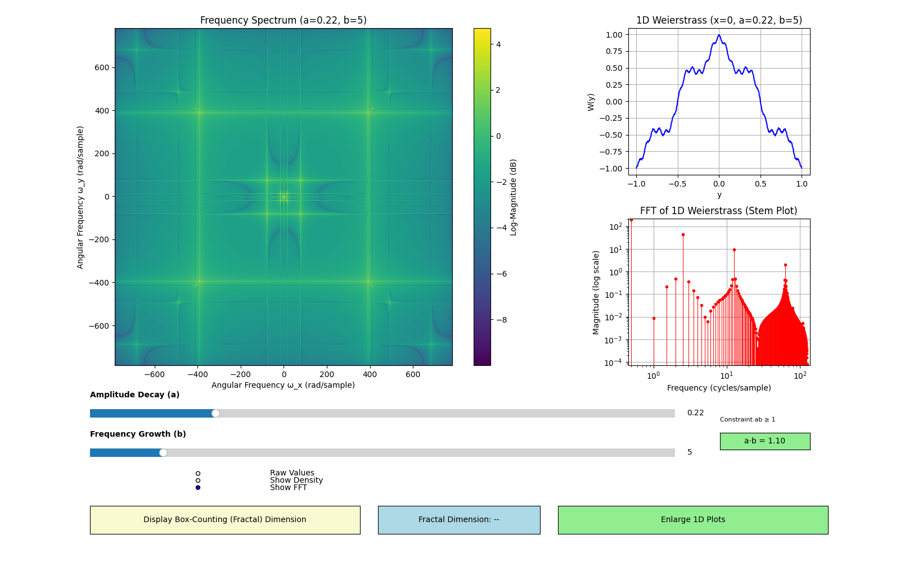

# 2D-Weierstrass Function Visualization Toolkit


## 📌 Overview

This interactive Python tool visualizes the **2D Weierstrass function**—a fascinating extension of the classic 1D function known for being **continuous everywhere but differentiable nowhere**. The application provides multiple perspectives on this mathematical curiosity, including:

1. Raw function visualization (2D and 1D)
2. Density distribution mapping (2D)
3. Frequency spectrum analysis (FFT for both 2D and 1D)
4. Fractal dimension calculation (2D)

---

## 🚀 Key Features

* **Interactive controls** for parameters `a` (amplitude decay) and `b` (frequency scaling)
* **Multiple visualization modes**:
  * Raw function values (2D and 1D)
  * Value density distribution (2D)
  * Fast Fourier Transform (FFT) spectrum (2D and 1D)
* **Box-counting dimension** calculation for fractal analysis
* **Real-time updates** via Numba-accelerated computation
* **Visual heuristic** indicating when fractal behavior emerges (a·b ≥ 1)

---

## 📐 Mathematical Foundation

The 2D Weierstrass function is defined as:

$$
\Huge
W(x, y) = \sum_{n=0}^{N} a^n \cdot \cos(\pi b^n x) \cdot \cos(\pi b^n y)
$$

Where:

* $a \in (0,1)$ controls **amplitude decay**
* $b \in \{3, 5, 7, \dots\}$ (odd integers) controls **frequency growth**
* $N = 30$ is the number of terms used for approximation

> **Note on Finite Approximation**:  
> While the infinite Weierstrass function is nowhere differentiable, our visualization uses a **finite approximation** (N=30 terms). This truncated version:
>
> * Is smooth (infinitely differentiable)
> * Forms a trigonometric polynomial
> * Permits standard FFT analysis
>
> The FFT visualizations show exact spectral composition of this approximation, which captures the *emergent fractal properties* of the true function when a·b ≥ 1.

The 1D slice, typically taken at $x=0$, simplifies to:

$$
\Huge
W(0, y) = \sum_{n=0}^{N} a^n \cdot \cos(0) \cdot \cos(\pi b^n y) = \sum_{n=0}^{N} a^n \cdot \cos(\pi b^n y)
$$

This highlights that the 1D function is a sum of cosine waves with geometrically increasing frequencies and exponentially decreasing amplitudes.

---

## 🔍 Visualization Modes

### 2D Visualizations

These modes apply to the full 2D function surface.

#### 1. Raw Function Values


* **X/Y Axes**: Spatial coordinates in [-1, 1] range
* **Color**: Normalized function value (blue = negative, red = positive)
* **Title**: "Normalized 2D Weierstrass Function"
* Shows actual output of the mathematical function

#### 2. Density Approximation


* **X/Y Axes**: Spatial coordinates in [-1, 1] range
* **Color**: Probability density of values
* **Title**: "Value Probability Density"
* Reveals value distribution independent of location

#### 3. FFT Spectrum (2D)



* **X/Y Axes**: Angular frequency (rad/sample)
* **Color**: Log-magnitude (dB scale)
* **Title**: "Frequency Spectrum"
* Shows dominant spatial frequencies and orientations present in the 2D surface. The FFT operates on our **finite smooth approximation** of the Weierstrass function, showing:
  * Discrete frequency components at ω = (kπ, mπ)
  * Emergent power-law scaling when a·b ≥ 1

### 1D Visualization

This section focuses on a 1D slice of the Weierstrass function (specifically, $x=0$) and its frequency content.

#### 1. 1D Weierstrass Function (x=0)


* **X-axis**: Spatial coordinate `y`
* **Y-axis**: Normalized function value `W(0, y)`
* **Title**: "1D Weierstrass Function (x=0)"
* Displays a cross-section of the 2D surface, revealing the intricate, non-differentiable oscillations characteristic of the function. This plot directly shows the summation of cosine waves at various frequencies.

#### 2. FFT of 1D Weierstrass Function (Stem Plot)

* **X-axis**: **Frequency (cycles/sample)**
  * This axis represents the spatial frequencies present in the 1D function. "Cycles/sample" indicates how many complete cycles of a wave occur within the span of one discrete data point (sample) in the `y` dimension.
  * For a digitally sampled signal, the frequency is often normalized to the sampling rate. A value of 0.5 cycles/sample is the Nyquist frequency, representing the highest frequency that can be uniquely resolved.
* **Y-axis**: **Magnitude (log scale)**
  * This shows the **amplitude** or **strength** of each frequency component. A logarithmic scale is used to better visualize the wide range of magnitudes.
* **Plot Type**: **Stem Plot**
  * A stem plot is ideal here because the FFT of the Weierstrass function yields **discrete, distinct frequency components**. Each "stem" corresponds to one of the cosine terms in the sum $a^n \cdot \cos(\pi b^n y)$.
* **Interpretation**:
  * You will observe **distinct stems (peaks)** at frequencies corresponding to $\pi, b\pi, b^2\pi, \ldots, b^{N-1}\pi$ (transformed into cycles/sample units by the FFT). These are the fundamental frequencies and their harmonics that build the Weierstrass function.
  * The **heights of these stems will progressively decrease** as frequency increases. This directly reflects the $a^n$ term in the Weierstrass definition, where higher frequencies have smaller amplitudes, contributing to the function's fine, self-similar details.
  * **Mathematical Note**: The clean spectral lines reflect our *finite smooth approximation*. Each stem corresponds exactly to a term in the sum $W_N(y) = \sum_{n=0}^{29} a^n \cos(\pi b^n y)$.

### Fractal Dimension Calculation

#### 4. Box-Counting Dimension (2D)


* Calculates fractal dimension using box-counting method on the 2D surface.
* Requires `a·b ≥ 1` (fractal condition for the 1D Weierstrass function; this condition is extended heuristically to 2D in this visualization).
* Displayed in a dedicated box when calculated, turning green if the condition is met and calculation is possible.

---

## ⚙️ Technical Implementation

### Optimized Computation

```python
@njit
def compute_weierstrass_2d_precomputed(X, Y, a_powers, b_freqs):
    # Computes FINITE approximation (N=30) 
    # This smooth trigonometric polynomial is FFT-suitable
    W = np.zeros_like(X)
    for n in range(len(a_powers)):  # n=0 to 29
        W += a_powers[n] * np.cos(b_freqs[n] * X) * np.cos(b_freqs[n] * Y)
    return W

@njit
def compute_weierstrass_1d(y, a_powers, b_freqs):
    total = np.zeros_like(y)
    for n in range(len(a_powers)):
        total += a_powers[n] * np.cos(b_freqs[n] * y)
    return total
```

* Uses Numba JIT compilation for 100x speedup.
* `compute_weierstrass_1d` is used for the 1D plot and its FFT.
* Precomputes power series for efficiency.

### Box-Counting Algorithm

```python
@njit
def box_counting_dimension(Z, epsilons):
    # Normalize Z to [0,1]
    # Create 3D grid (x, y, value)
    # Count occupied boxes at different scales
    # Calculate dimension via log-log regression
```

* Operates in normalized value space.
* Uses linear regression on log-scale data.

### FFT Analysis

```python
def compute_fft(Z): # For 2D FFT
    fft_Z = np.fft.fft2(Z)
    fft_shifted = np.fft.fftshift(fft_Z)
    return np.log10(np.abs(fft_shifted) + 1e-10)
```

* `np.fft.fft2` computes the 2D Fourier transform.
* `np.fft.fft` computes the 1D Fourier transform (used for the 1D FFT plot).
* Shifts zero-frequency to center (for 2D) or provides appropriate frequency bins (for 1D).
* Applies logarithmic scaling for better visualization of magnitude.

---

## 📊 Visualization Legend

| Element          | Raw View (2D)   | Density View (2D) | FFT View (2D)          | 1D Plot (x=0)   | 1D FFT (Stem)   |
|------------------|-----------------|-------------------|------------------------|-----------------|-----------------|
| **X-axis** | X Coordinate    | X Coordinate      | ω_x (rad/sample)       | Y Coordinate    | Freq (cycles/sample)|
| **Y-axis** | Y Coordinate    | Y Coordinate      | ω_y (rad/sample)       | W(0,y) Value    | Magnitude (log) |
| **Color/Lines** | Function value  | Probability       | Log-magnitude (dB)     | Blue line       | Red stems       |
| **Range (X/Y)** | [-1, 1]         | [-1, 1]           | [-π, π] rad/sample    | [-1, 1]         | [0, max Freq]   |
| **Aspect Ratio** | 1:1             | 1:1               | 1:1                    | N/A             | N/A             |

---

## 🔑 Key Clarifications

1. **Two distinct "frequency" concepts:**
    * **Parameter `b`**: Controls the scaling of frequencies in the *mathematical definition* of the Weierstrass function itself (e.g., $\pi, b\pi, b^2\pi$).
    * **FFT analysis**: Measures the spatial frequencies present in the *visual output* of the rendered function.
    * These are intrinsically related but represent different stages of understanding: one is a *design parameter*, the other is a *measured property* of the result.
    * **Unit Conversion**: Angular frequency (rad/sample) = 2π × cycles/sample

2. **Density vs FFT:**
    * **Density** (2D) shows the **frequency of occurrence of function values** (e.g., how often does the function output a value of 0.5 vs. 0.1?).
    * **FFT** (2D and 1D) shows the **frequency of spatial patterns or oscillations** (e.g., how often does a specific pattern of peaks and valleys repeat across the surface or along the 1D line?).

3. **Practical interpretation:**
    * Higher `b` → More fine details in the function → More energy at higher frequencies in the FFT.
    * Higher `a` → Sharper contrasts and more pronounced oscillations → Wider value distribution and potentially more high-frequency energy.
    * `a·b ≥ 1` → Fractal behavior is typically expected (for the 1D function, this is the condition for non-differentiability and fractal dimension > 1) → Valid fractal dimension calculation.

4. **Finite vs Infinite**:  
   * The classical Weierstrass function requires distributional Fourier analysis  
   * Our finite approximation (N=30) is smooth and FFT-compatible  
   * Fractal characteristics emerge visibly when a·b ≥ 1  

5. **Mathematical ↔ FFT Frequency Relationship**:
   * The cosine terms in the Weierstrass definition use *angular frequencies*: $\omega_n = \pi b^n$ rad/unit
   * The 1D FFT shows these as *cyclic frequencies*: $f_n = \omega_n / (2\pi) = b^n / 2$ cycles/unit
   * Example: For b=5, the first stem appears at $5^0/2 = 0.5$ cycles/unit

---

## 🧩 Parameter Effects

| Parameter Change | Raw View          | Density View       | FFT View (2D)          | 1D Plot           | 1D FFT (Stem)     | Dimension   |
|------------------|-------------------|--------------------|------------------------|-------------------|-------------------|-------------|
| **a ↑** | Sharper contrasts | Wider distribution | More high-frequency energy | Larger amplitudes | Higher stems overall | ↑ (0.1-0.3) |
| **b ↑** | Finer details     | More complex peaks | Energy shifts outward   | More oscillations | Stems shift to higher frequencies | ↑ (0.1-0.4) |
| **a·b ≥ 1** | Fractal patterns  | Heavy tails        | Power-law spectrum      | Highly jagged     | Clear, distinct peaks | Valid result|

---

## ▶️ Getting Started

* Install requirements:

```bash
pip install numpy matplotlib numba
```

* Run the script:

```bash
python weierstrass_fractal_explorer.py
```

* Interact with controls:
  * Adjust `a` and `b` sliders.
  * Toggle visualization modes to explore different aspects (Raw, Density, FFT).
  * Click "Display Box-Counting (Fractal) Dimension" to compute the fractal dimension when `a·b ≥ 1`.

---

## 📚 References

1. Weierstrass, K. (1872). On continuous functions of a real argument that do not have a well-defined differential quotient.  
K. Weierstrass, *Mathematische Werke*, Vol 2, 1872. [Archive.org](https://archive.org/details/mathematischewer02weieuoft/page/n101)
2. Falconer, K. (2013). Fractal Geometry: Mathematical Foundations and Applications.
3. Mandelbrot, B. B. (1982). The Fractal Geometry of Nature.
