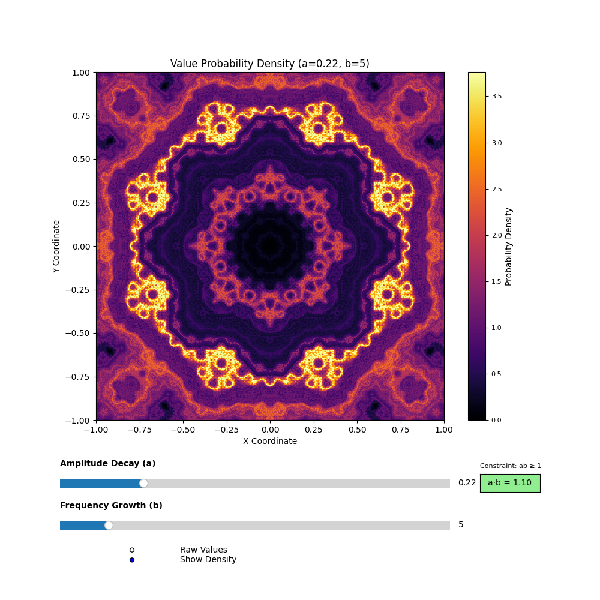

# Isotropic 8-Directional 2D Weierstrass Function Density Visualization

*Example output for* `a = 0.22`, `b = 5`

---

## 📌 Overview

This project visualizes an **isotropic extension** of the 2D Weierstrass function, defined as a sum over eight equally spaced directions. It builds on the classic 1D function known for being **continuous everywhere but differentiable nowhere**, extending it into a richer, more directionally uniform fractal surface.

---

## Key Features

* Interactive sliders for parameters `a` (amplitude decay) and `b` (frequency scaling, **odd integers only**)
* Real-time updates with **Numba-accelerated computation**
* **Histogram-based density visualization** reveals statistical distribution of values in a perceptual way
* Isotropic summation over eight directions ensures rotational symmetry in the fractal texture

---

## 📐 Mathematical Definition

The isotropic 2D Weierstrass function is defined as:

$$
\Huge
W(x, y) = \sum_{n=0}^{N} a^n \cdot \frac{1}{8} \sum_{k=1}^{8} \cos \left( \pi b^n \left( x \cos \theta_k + y \sin \theta_k \right) \right)
$$

where

* \(a \in (0,1)\) controls **amplitude decay**
* \(b \in \{3, 5, 7, \dots\}\) (odd integers) controls **frequency growth**
* \(N = 40\) is the number of terms used for the finite approximation
* \(\theta_k = \frac{2\pi (k-1)}{8}\) are eight equally spaced angles from 0 to \(2\pi\)

---

## Key Properties

| Property                        | Description                                                    |
| ------------------------------- | -------------------------------------------------------------- |
| **Isotropy**                   | Sum over eight directions produces rotationally symmetric texture |
| **Continuity**                  | Uniformly convergent sum → continuous fractal surface          |
| **Complex fractal texture**    | Richer directional complexity than separable product form      |
| **Parameter-sensitive**         | Small changes in `a` or `b` yield visually distinct fractal patterns |

---

⚠️ **Note on Differentiability and Slicing**

Unlike the classic product 2D form, this isotropic version combines eight directional oscillations.  
- **No single 1D slice corresponds exactly to a classical 1D Weierstrass function.**  
- The fractal complexity is spread evenly in all directions, enhancing isotropy but making analytical properties like differentiability subtler and less understood.

---

## ⚠️ Parameter Constraint $( a b \geq 1 )$

In the 1D case, $( a b \geq 1 )$ (with odd integer \(b\)) ensures strong fractal behavior with jagged irregularities.  
For this isotropic 2D extension, the same condition influences surface roughness but does **not guarantee a sharp fractal transition**. Directional averaging smooths extremes, making fractal features more gradual and less visually pronounced.

---

## Why 2D Isotropic?

The classical 1D Weierstrass function generates jagged lines.  
The isotropic 2D sum creates **directionally uniform fractal surfaces**, suitable for:

* Exploring mathematically intriguing, rotationally symmetric fractals
* Generating rough, naturalistic surfaces and textures
* Visualizing how multidirectional oscillations combine to create complex patterns

---

## 📊 Interpreting the Visualization

### What You See

* **Color intensity = density of values**

  * Dark areas: rare values  
  * Bright areas: frequently occurring values  

### Parameter Effects

| Parameter | Role                      | Visual Impact                                           |
| --------- | ------------------------- | ------------------------------------------------------- |
| `a`       | Controls term amplitude   | ↑ `a` = rougher terrain, sharper contrasts              |
| `b`       | Controls frequency growth | ↑ `b` = more fine-grained fractal details, richer texture |

---

### Example Behaviors

* **Low `a` (0.1–0.3)** → Smooth, wave-like textures  
* **High `a` (0.7–0.9)** → Jagged, rough surfaces  
* **Low `b` (3–7)** → Coarser fractal structure  
* **High `b` (15–19)** → Rich fine details, dense fractal patterns  
