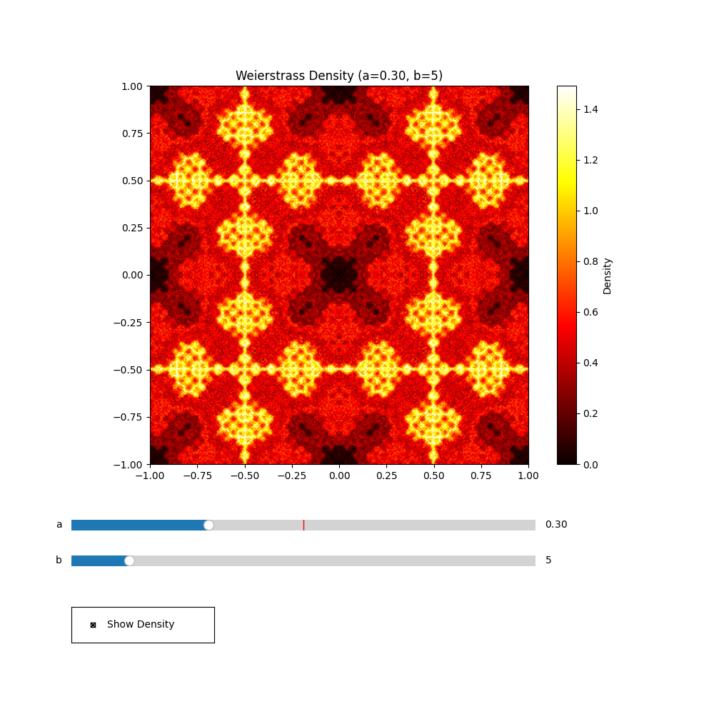

# Weierstrass Function Density Visualization

*Example output for* `a = 0.22`, `b = 5`

---

## 📌 Overview

This project visualizes the **2D Weierstrass function**—a fascinating extension of the classic 1D function known for being **continuous everywhere but differentiable nowhere**. The 2D version creates rich, fractal-like textures that reveal hidden mathematical complexity in both dimensions.

---

## Key Features

* Interactive sliders for parameters `a` (amplitude decay) and `b` (frequency scaling, **odd integers only**)
* Real-time updates via **Numba-accelerated computation**
* **Histogram-based density approximation** to highlight value distributions in a perceptual way

---

## 📐 Mathematical Definition

The 2D Weierstrass function is defined as:

$$
W(x, y) = \sum_{n=0}^{N} a^n \cdot \cos(\pi b^n x) \cdot \cos(\pi b^n y)
$$

Where:

* $a \in (0,1)$ controls **amplitude decay**
* $b \in \{3, 5, 7, \dots\}$ (odd integers) controls **frequency growth**
* $N = 20$ is the number of terms used for finite approximation

---

## Key Properties

| Property                        | Description                                                    |
| ------------------------------- | -------------------------------------------------------------- |
| **Continuity**                  | Uniformly convergent sum → continuous surface                  |
| **Nowhere differentiable**      | No well-defined tangent plane at any point                     |
| **Approximate self-similarity** | Fractal features emerge progressively, depending on parameters |
| **Parameter-sensitive**         | Small changes in `a` or `b` yield visually distinct patterns   |

---

## ⚠️ Note on Parameter Constraint $a b \geq 1$

In the classic 1D Weierstrass function, the condition $a b \geq 1$ with b restricted to odd integers ensures strong fractal behavior—sharp, jagged irregularities at all scales.

For this 2D extension, the same condition influences roughness but does **not** guarantee a clear fractal transition. The 2D function combines oscillations in both dimensions, which tends to smooth features and makes fractality more subtle and gradual.

While the 2D Weierstrass function exhibits fractal-like complexity, its fractal nature is less visually striking than the 1D case.

---

## Why 2D?

The 1D Weierstrass function produces jagged lines—interesting, but limited. The 2D version produces stunning fractal surfaces, useful for:

* Exploring patterns and complexity in two dimensions
* Generating rough surfaces, like terrain or noise maps
* Visualizing how simple rules can lead to intricate forms

---

## 📊 Interpreting the Visualization

### What You’re Seeing

* **Color intensity = density of values**

  * Darker areas: Values that occur less frequently
  * Brighter areas: Values that appear more often  

### Parameter Effects

| Parameter | Role                      | Visual Impact                                           |
| --------- | ------------------------- | ------------------------------------------------------- |
| `a`       | Controls term amplitude   | ↑ `a` = rougher terrain, more sharp contrast            |
| `b`       | Controls frequency growth | ↑ `b` = more fine-grained fractal detail, gradual onset |

---

### Example Behaviors

* **Low `a` (0.1–0.3)** → Smooth, flowing waveforms
* **High `a` (0.7–0.9)** → Jagged, mountainous terrain
* **Low `b` (3–7)** → Coarse structure dominates
* **High `b` (15–19)** → Rich detail, complex self-similarity
