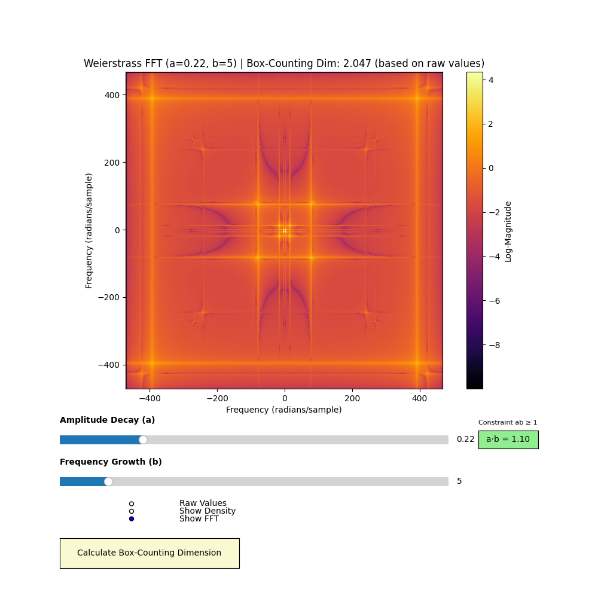

# Weierstrass Function Visualization Toolkit



## 📌 Overview

This interactive Python tool visualizes the **2D Weierstrass function**—a fascinating extension of the classic 1D function known for being **continuous everywhere but differentiable nowhere**. The application provides multiple perspectives on this mathematical curiosity, including:

1. Raw function visualization
2. Density distribution mapping
3. Frequency spectrum analysis (FFT)
4. Fractal dimension calculation

---

## 🚀 Key Features

* **Interactive controls** for parameters `a` (amplitude decay) and `b` (frequency scaling)
* **Multiple visualization modes**:
  * Raw function values
  * Value density distribution
  * Fast Fourier Transform (FFT) spectrum
* **Box-counting dimension** calculation for fractal analysis
* **Real-time updates** via Numba-accelerated computation
* **Visual heuristic** indicating when fractal behavior emerges (a·b ≥ 1)

---

## 📐 Mathematical Foundation

The 2D Weierstrass function is defined as:

$$
W(x, y) = \sum_{n=0}^{N} a^n \cdot \cos(\pi b^n x) \cdot \cos(\pi b^n y)
$$

Where:

* $a \in (0,1)$ controls **amplitude decay**
* $b \in \{3, 5, 7, \dots\}$ (odd integers) controls **frequency growth**
* $N = 20$ is the number of terms used for approximation

---

## 🔍 Visualization Modes

### 1. Raw Function Values

Visualizes the normalized output of the Weierstrass function using a coolwarm colormap. Shows the characteristic fractal patterns of the surface.

### 2. Density Approximation

Uses histogram analysis to show how frequently different values appear in the output. Highlights the value distribution rather than spatial patterns.

### 3. FFT Spectrum

Applies Fast Fourier Transform to reveal the frequency components of the surface. The logarithmic magnitude spectrum shows dominant frequencies and their spatial orientations.

### 4. Box-Counting Dimension

Calculates the fractal dimension using the box-counting method based on raw function values. Provides a quantitative measure of surface complexity.

---

## ⚙️ Technical Implementation

### Optimized Computation

```python
@njit
def compute_weierstrass_2d_precomputed(X, Y, a_powers, b_freqs):
    W = np.zeros_like(X)
    for n in range(len(a_powers)):
        W += a_powers[n] * np.cos(b_freqs[n] * X) * np.cos(b_freqs[n] * Y)
    return W
```

* Uses Numba JIT compilation for 100x speedup
* Precomputes power series for efficiency

### Box-Counting Algorithm

```python
@njit
def box_counting_dimension(Z, epsilons):
    # Normalize Z to [0,1]
    # Create 3D grid (x, y, value)
    # Count occupied boxes at different scales
    # Calculate dimension via log-log regression
```

* Operates in normalized value space
* Uses linear regression on log-scale data

### FFT Analysis

```python
def compute_fft(Z):
    fft_Z = np.fft.fft2(Z)
    fft_shifted = np.fft.fftshift(fft_Z)
    return np.log10(np.abs(fft_shifted) + 1e-10)
```

* Computes 2D Fourier transform
* Shifts zero-frequency to center
* Applies logarithmic scaling

---

## 📊 Interpretation Guide

### Raw Values Mode

* **Blue regions**: Negative function values
* **Red regions**: Positive function values
* **White regions**: Values near zero
* *Shows actual output of the mathematical function*

### Density Mode

* **Bright areas**: Frequently occurring values
* **Dark areas**: Rare values
* *Reveals probability distribution of values, independent of location*

### FFT (Frequency Analysis) Mode

* **Center area**: Large-scale patterns (low spatial frequencies)
* **Edge area**: Fine details and texture (high spatial frequencies)
* **Symmetry**: Result of real-valued input (mathematical property)
* **Radial patterns**: Indicator of scale-invariant structure
* *Analyzes pattern repetition rates in the visual output*

### Box-Counting Dimension

* **2.0-2.2**: Relatively smooth surface
* **2.2-2.5**: Moderate fractal complexity
* **>2.5**: Strong fractal characteristics
* *Note 1: Calculation based on raw function values*
* *Note 2: Meaningful only when a·b ≥ 1*
* *Note 3: Values depend on resolution and epsilon range*

---

## 🔑 Key Clarifications

1. **Two distinct "frequency" concepts:**
   * **Parameter b**: Controls term frequencies in *function definition*
   * **FFT analysis**: Measures spatial frequencies in *visual output*
   * These are related but separate concepts

2. **Density vs FFT:**
   * Density shows **value occurrence frequency**
   * FFT shows **pattern repetition frequency**

3. **Practical interpretation:**
   * Higher parameter `b` → More fine details → More FFT energy at edges
   * Higher parameter `a` → Sharper contrasts → Wider value distribution in density view

---

## 🧩 How Parameters Affect Visualizations

| Parameter Change | Raw View          | Density View       | FFT View               | Dimension   |
|------------------|-------------------|--------------------|------------------------|-------------|
| **a ↑**          | Sharper contrasts | Wider distribution | More high-frequency energy | ↑ (0.1-0.3) |
| **b ↑**          | Finer details     | More complex peaks | Energy shifts outward   | ↑ (0.1-0.4) |
| **a·b ≥ 1**      | Fractal patterns  | Heavy tails        | Power-law spectrum      | Valid result|

---

## ▶️ Getting Started

* Install requirements:

```bash
pip install numpy matplotlib numba
```

* Run the script:

```bash
python weierstrass_visualizer.py
```

* Interact with controls:

* Adjust `a` and `b` sliders
* Toggle visualization modes
* Click "Calculate Box-Counting Dimension" for fractal analysis

---

## 📚 References

1. Weierstrass, K. (1872). On continuous functions of a real argument that do not have a well-defined differential quotient.
2. Falconer, K. (2013). Fractal Geometry: Mathematical Foundations and Applications.
3. Mandelbrot, B. B. (1982). The Fractal Geometry of Nature.
