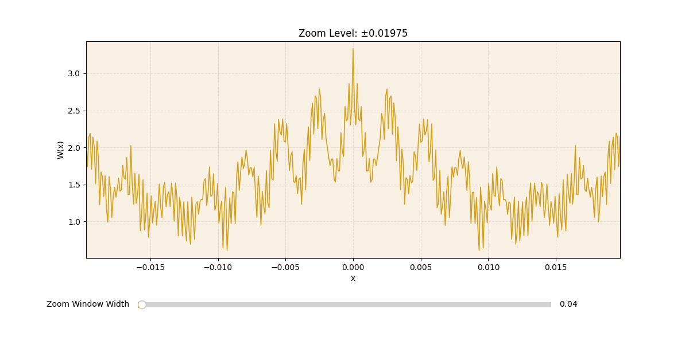

# 🔍 **Exploring the Weierstrass Function with Deep Zoom**

✅ Continuous everywhere | ❌ Differentiable nowhere

The Weierstrass function is a classic example of a pathological function — a mathematical object that defies our everyday intuition. Despite being continuous at every point, it’s differentiable nowhere. That means it has no well-defined slope or tangent, no matter how closely you examine it. Its infinitely “rough” structure exhibits intricate wiggles at every scale, making it both fascinating and frustrating.

---

## 📐 **The Mathematics Behind It**

Formally, the function is defined as an infinite sum:

$$
\Huge
W(x) = \sum_{n=0}^{\infty} a^{n} \cos\left(b^{n} \pi x\right)
$$

subject to the conditions:

* $\large 0 < a < 1$
* $\large b$ is an odd integer
* $\large a \times b > 1 + \frac{3\pi}{2}$

These constraints guarantee the function’s fractal, nowhere differentiable behavior, ensuring it oscillates wildly no matter how closely you zoom in.

Weierstrass originally required only ab>1, later work by G.H. Hardy (1916) showed that the stronger condition in the formula above is needed to guarantee that the function is nowhere differentiable.
This implementation enforces Hardy's stricter condition to ensure mathematical certainty of the function's fractal behaviour at all scales.

---

## 🎨 **Visualizing the Function**

Visualizing such a fractal object poses challenges — zooming in reveals ever more oscillations without any smoothening. To explore this phenomenon interactively, I developed a Python visualization featuring a manual zoom slider functioning like a microscope.

Starting from a broad view, you can zoom in as deeply as ±0.00025 units. The plot dynamically updates its sampling density to keep the curve smooth at every scale. The y-axis rescales automatically to highlight the local amplitude of oscillations clearly.

---

## 🔍 **What Happens at Extreme Zoom?**

At the highest zoom levels, the function’s graph may visually appear as a single peak or smooth segment. This, however, does **not** imply differentiability. Instead:

* The narrow viewing window captures just one local wavelet.
* Finer oscillations exist beyond the visible resolution or sample density.
* Increasing the sample density further reveals smaller-scale oscillations, endlessly unfolding the fractal complexity.

Thus, the visualization remains mathematically rigorous, respecting the infinite intricacy of the Weierstrass function, while providing an intuitive, microscope-like exploration experience.

---

## 🧠 Why Does This Matter?

Originally constructed as a counterexample to challenge assumptions in 19th-century analysis, the Weierstrass function has since inspired a deeper understanding of fractals, roughness, and irregularity in mathematical systems. Beyond pure theory, concepts derived from such functions inform:

* Signal processing – modeling noise and irregular waveforms
* Fractal geometry – foundational for textures in computer graphics
* Time series analysis – describing self-similar patterns in finance and nature
* Mathematical rigor – sharpening definitions in real analysis and functional spaces  

Though often labeled “pathological,” the Weierstrass function has found its place as a valuable tool for understanding complexity and unpredictability in both theory and application.

---

## 🚀 **Try It Yourself**

Run the provided Python script to interactively explore the Weierstrass function’s fractal structure. Move the zoom slider and watch this elegant mathematical object reveal detail at every scale — a vivid demonstration of how continuity and roughness coexist in analysis.

This hands-on visualization bridges abstract theory and tangible intuition.

---

## 📁 **References**

* K. Weierstrass, *Mathematische Werke*, Vol 2, 1872. [Archive.org](https://archive.org/details/mathematischewer02weieuoft/page/n101)
