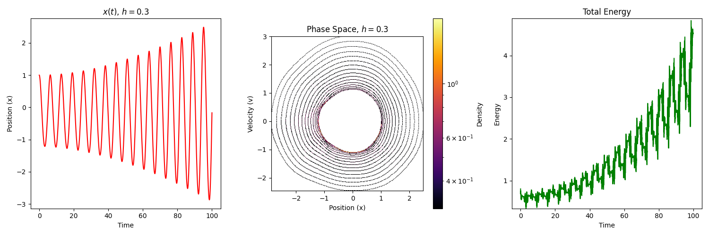
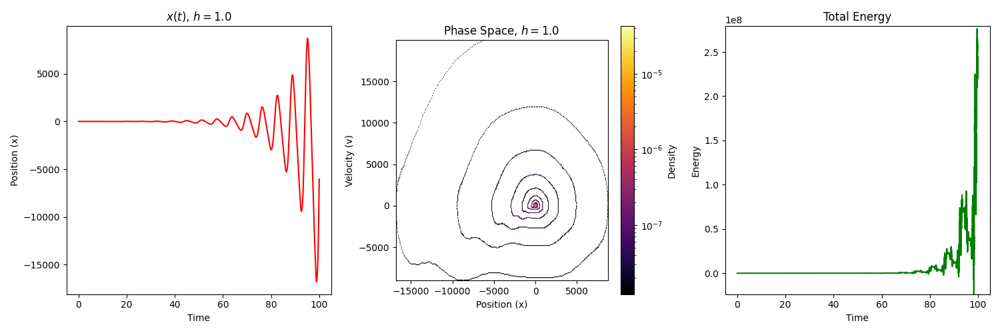

# Weierstrass-Modulated Parametric Oscillator Simulation

This project simulates a parametric oscillator driven by the Weierstrass function, exploring both regular and fractal dynamical regimes. The simulation visualizes phase space patterns and time series behavior under different modulation strengths.

## Key Features

- **Physics Accuracy**: Models the differential equation:

```markdown

  ẍ + ω₀²(1 + h·W(t))x = 0

  ```

  where W(t) is the Weierstrass function.

- **Numerical Efficiency**:
  - Numba-accelerated ODE solver
  - Velocity Verlet integration (energy-preserving)
  - Adaptive visualization (switches between direct/density plots)

- **Visualization**:
  - Time series of position x(t)
  - 2D/3D phase space plots
  - Energy conservation diagnostics

## Mathematical Background

### Governing Equation

The system represents a harmonic oscillator with stiffness modulated by the Weierstrass function:

```markdown

W(t) = Σₙ aⁿ cos(bⁿ t)

```

where:

- 0 < a < 1 (amplitude decay)
- b is an odd integer > 1 + 3π/2
- ab > 1 (ensures fractal properties)

### Special Cases

1. **h = 0**: Simple harmonic oscillator (perfect ellipse/circle in phase space)
2. **0 < h < 0.3**: Perturbed periodic motion
3. **h > 0.5**: Potential chaos or strange non-chaotic attractors

## Usage

### Basic Simulation

```python
# Set parameters
omega0 = 1.0  # Natural frequency
h = 0.3       # Modulation strength (0 to 1)
t_max = 100   # Simulation duration

# Run and plot
x, v = solve_oscillator(t, omega0, h, a=0.5, b=7, n_terms=30, dt=0.01)
plot_results(t, x, v, h)
```

### Parameter Exploration

| Parameter | Effect | Typical Range |
|-----------|--------|---------------|
| `h`       | Modulation strength | 0 (none) to 1 (strong) |
| `a`       | Weierstrass amplitude decay | 0.1-0.9 |
| `b`       | Frequency scaling | Odd integers ≥3 |
| `ω₀`      | Natural frequency | 0.5-2.0 |

## Visualization Examples

### h = 0 (No modulation)


- Perfect circular orbit (ω₀=1)
- Constant energy

### h = 0.3 (Weak modulation)



- Slightly distorted ellipse
- Small energy fluctuations

### h = 1.0 (Strong modulation)



- Self-similar patterns under zooming (suggests fractality)
- Intermittent energy jumps

## Advanced Features

### Energy Conservation Check

```python
E = 0.5*(v**2 + omega0**2*(1 + h*W)*x**2)
plt.plot(t, E)  # Should be ~constant for good integration
```

## Requirements

- Python 3.8+
- NumPy
- Matplotlib
- Numba (for acceleration)

## References

1. Weierstrass function: Hardy (1916)
2. Parametric oscillators: Nayfeh & Mook (1979)
3. Chaos theory: Strogatz (2014)

```md

This README provides:
1. **Clear physics context** for the simulation
2. **Ready-to-run code examples**
3. **Visual examples** of expected outputs
4. **Parameter tuning guide**
5. **Advanced diagnostics**

